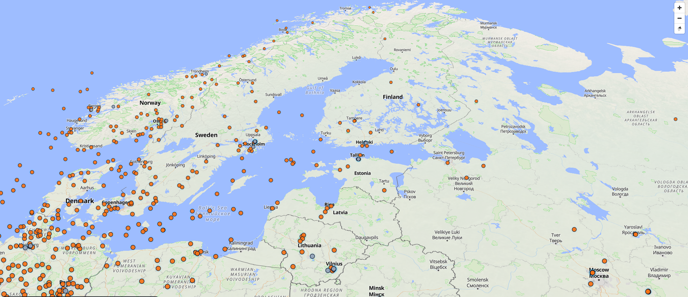

# Geo Tracker



A real-time aircraft tracking application built with FastAPI, PostGIS, WebSockets, and React.

The project ingests live aircraft state vectors from the OpenSky Network, stores and updates aircraft positions in PostgreSQL/PostGIS, and visualizes traffic on an interactive map frontend powered by MapLibre GL.

---

## Features

* Real-time aircraft tracking
* WebSocket-based live updates
* Viewport/bounding-box querying for efficient map rendering
* PostGIS spatial database integration
* GeoJSON-based backend/frontend communication
* Interactive map with live aircraft positions
* Async polling pipeline using FastAPI + asyncio
* Incremental feature merging on the frontend
* Terrain support groundwork for future 3D visualization

---

## Tech Stack

### Backend

* Python 3.12
* FastAPI
* SQLAlchemy (async)
* PostgreSQL
* PostGIS
* WebSockets
* httpx
* asyncio
* pytest

### Frontend

* React
* TypeScript
* Vite
* MapLibre GL
* GeoJSON

### Data Source

* OpenSky Network API

---

## Architecture Overview

```text id="7vv5qm"
OpenSky API
    ↓
FastAPI polling service
    ↓
PostgreSQL + PostGIS
    ↓
REST API + WebSocket updates
    ↓
React + MapLibre frontend
```

The backend periodically polls OpenSky state vectors, transforms them into GeoJSON features, and upserts aircraft data into PostGIS.

The frontend:

* fetches viewport-specific aircraft data
* subscribes to live updates via WebSockets
* merges incremental updates into the current map state

---

## Spatial Concepts

The frontend uses:

* viewport-based loading
* bounding box (`bbox`) filtering
* GeoJSON features
* spatial queries

This allows the application to efficiently render only the aircraft relevant to the user's current visible map area.

---

## Development Goals

This project started as a way to explore:

* geospatial systems
* real-time backend architecture
* async Python
* WebSockets
* map rendering
* spatial databases

It is also becoming a playground for experimenting with:

* scalable real-time systems
* geospatial visualization
* aviation data pipelines
* clean architecture and testing practices

---

## Future Ideas

Potential future directions for the project:

### 3D Map Rendering

* true 3D terrain
* aircraft altitude visualization
* camera controls
* atmospheric effects

### Aircraft Models

* rendering actual 3D airplane models instead of circles
* orientation based on heading/track
* animation/interpolation between updates

### Historical Playback

* time slider
* replay previous aircraft movement
* path visualization

### Advanced Tracking

* aircraft filtering
* tracking specific ICAO24 identifiers
* persistent labels and metadata

### Performance & Infrastructure

* Redis pub/sub
* Kafka or streaming pipelines
* tile/vector optimizations
* reverse proxy deployment with Nginx
* CDN-backed frontend hosting

### Additional Data Sources

* weather overlays
* satellite imagery
* terrain datasets
* ADS-B aggregation alternatives

---

## Status

Early-stage but actively evolving. I used Cursor for structuring the initial state of the project, and am now manually refactoring it piece by piece.

Current focus areas:

* backend architecture
* spatial querying
* testing practices
* real-time update pipeline
* frontend map rendering

```
```